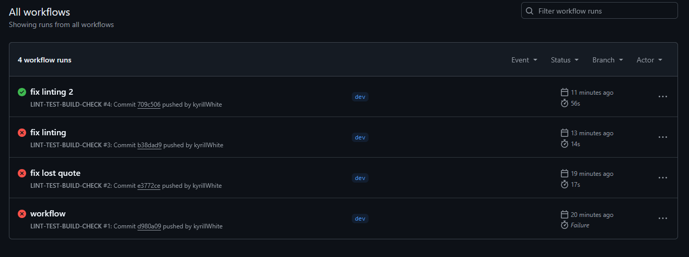
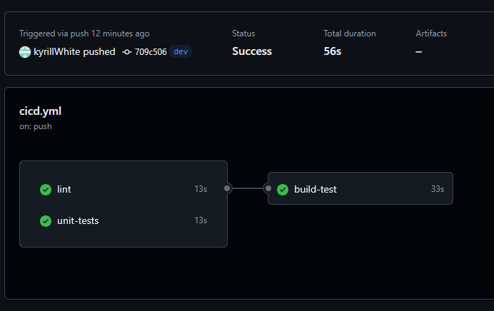

# Лаб 11. CICD 

## Было сделано

- Подготовлено web приложение на python [application.py](server/application.py).
- Написан python скрипт с unit тестами приложения web приложение на python [test_application.py](server/test_application.py).
- Подготовлен [dockerfile](server/dockerfile) для контейнеризации python приложения.
- Написан [cicd.yml](.github/workflows/cicd.yml), выполняющий GitHub Actions (линтинг, unit-тестирование, сборка) при пушинге в GitHub.

## Скриншоты:

**Запущенные CI workflow для линтинга и тестов**

