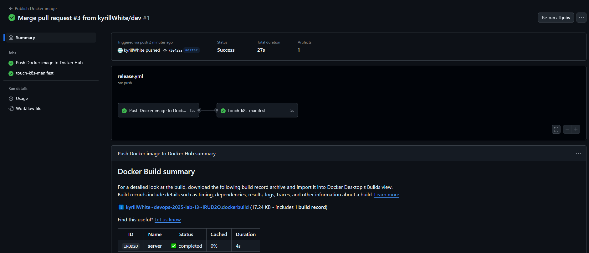
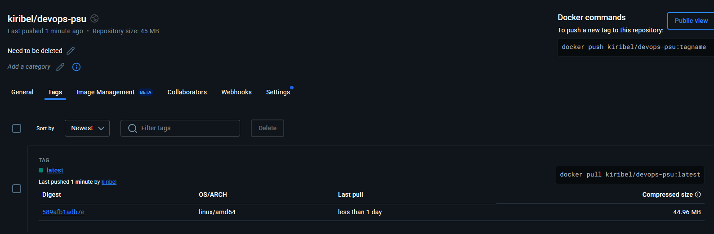

# Лаб 11. CICD 

## Было сделано

### Python приложение и CI
- Подготовлено web приложение на python [application.py](server/application.py).
- Написан python скрипт с unit тестами приложения web приложение на python [test_application.py](server/test_application.py).
- Подготовлен [dockerfile](server/dockerfile) для контейнеризации python приложения.
- Написан [cicd.yml](.github/workflows/cicd.yml), выполняющий GitHub Actions (линтинг, unit-тестирование, сборка) при пушинге в GitHub.

### CD и пуш в DockerHub
- Подготовлен [k8s манифест](server-k8s-manifests/devops-psu.yml), который будет использоваться для развертывания приложения
- Добавлен новый workflow [release](.github/workflows/release.yml) в GitHub Actions для выполнения CD. После пуша в мастер выполняется сборка докер образа, и сам образ пушится в DockerHub. Место куда загружается образ сконфигурированно через GitHub секреты (прописаны логин пользователя и Access Token из DockerHub). Также в рамках [release](.github/workflows/release.yml) выполняется дупликация ветки `master` в ветку `release` с модификацией файла манифеста [devops-psu.yml](server-k8s-manifests/devops-psu.yml) - в него подставляется дата выполнения пайплайна в секундах.

## Скриншоты:

**Запущенные CI workflow для линтинга и тестов**

**Пуш образа приложения в DockerHub с использованием CD workflow**

